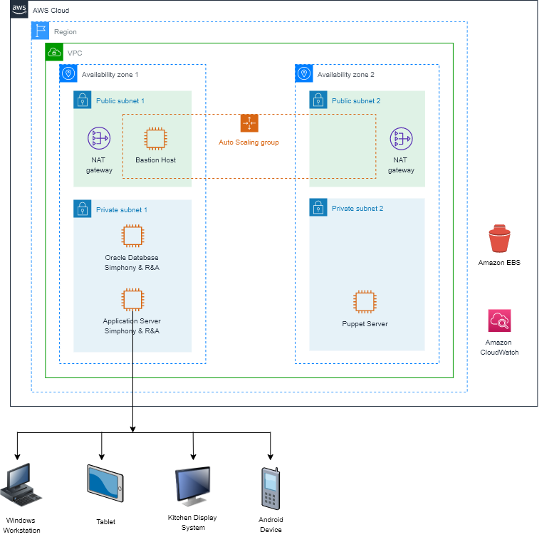

Deploying this Quick Start for a new virtual private cloud (VPC) with
*default parameters* builds the following _{partner-product-name}_ environment in the
AWS Cloud.

// Replace this example diagram with your own. Send us your source PowerPoint file. Be sure to follow our guidelines here : http://(we should include these points on our contributors giude)
[#architecture1]
.Quick Start architecture for _{partner-product-name}_ on AWS
[link=images/architecture_diagram.png]

As shown in Figure 1, the Quick Start sets up the following:

* A VPC configured with public and private subnets, according to AWS best practices, to provide you with your own virtual network on AWS.*

In the public subnets:

* Managed network address translation (NAT) gateways to allow outbound internet access for resources in the private subnets.*
* A Linux bastion host in an Auto Scaling group to allow inbound Secure Shell (SSH) access to EC2 instances in public and private subnets.*

In the private subnets:
// Add bullet points for any additional components that are included in the deployment. Make sure that the additional components are also represented in the architecture diagram.

* Oracle database running on an EC2 instance for the Simphony and Reporting and Analytics (R&A) applications database.
* An application server running on an EC2 instance for the Simphony and Reporting and Analytics (R&A) applications deployment.
* A Puppet server running on an EC2 instance for Oracle database installation, JDK installation, and Windows IIS server configuration.

*Amazon Data Lifecycle Manager (DLM)* to automate the creation, retention, and deletion of snapshots of the Amazon Elastic Block Storage (EBS) volumes. Automating snapshot management accomplishes the following:

* Protects valuable data by enforcing a regular backup schedule.
* Retains backups as required by auditors or for internal compliance.
* Reduces storage costs by deleting outdated backups.

DLM is configured as follows:

* The EC2 tag ( Name: *LCM_TAG* , Value: *SIM* ) key-value pair is used to take snapshots.
* The most recent 3 snapshots are retained. 
* A copy of each snapshot is stored in another AWS Region for data redundancy.

*Amazon CloudWatch* is a monitoring and observability service built for DevOps Engineers, Developers, Site Reliability Engineers (SREs), and IT managers. CloudWatch provides you with data and actionable insights to monitor your applications, respond to system-wide performance changes, optimize resource utilization, and get a unified view of operational health. CloudWatch collects monitoring and operational data in the form of logs, metrics, and events, providing you with a unified view of AWS resources, applications, and services that run on AWS. You can use CloudWatch to detect anomalous behavior in your environments, set alarms, visualize logs and metrics side by side, take automated actions, troubleshoot issues, and discover insights to keep your applications running smoothly. 

*The template that deploys the Quick Start into an existing VPC skips the components marked by asterisks and prompts you for your existing VPC configuration. 
